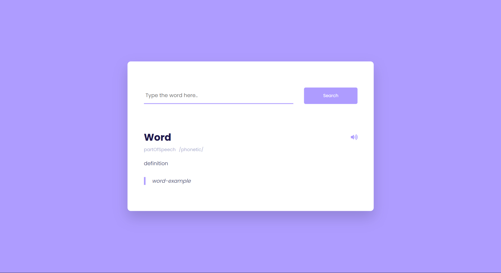

# 🔤 English Dictionary App

A clean and responsive web application for searching English word meanings, pronunciations, and examples. Built with **HTML**, **CSS**, and **Vanilla JavaScript**, this project utilizes the **Free Dictionary API** to provide instant linguistic data.



&nbsp;

## ✨ Features

- 🔍 **Instant Search:** Quickly find definitions, parts of speech, and phonetics.
- 🔊 **Audio Pronunciation:** Listen to the correct pronunciation of any word with a single click.
- 📱 **Responsive Design:** Fully adaptable layout for mobile, tablet, and desktop devices.
- 🎨 **Modern UI:** Clean interface using the *Poppins* font and a soothing color palette.
- ⚡ **Lightweight:** No external frameworks or libraries; pure Vanilla JavaScript.

&nbsp;

## 🛠️ Technologies Used

- **HTML5**: Semantic structure
- **CSS3**: Styling, Flexbox layout, and responsive design
- **JavaScript (ES6+)**: DOM manipulation, Fetch API, and event handling
- **Font Awesome**: Icons
- **Google Fonts**: Poppins Font
- **API**: [Free Dictionary API](https://dictionaryapi.dev/)

&nbsp;

## 📖 How to Use

1. Type an English word into the search input field.

2. Click the Search button or press Enter.

3. The result will display:
    - Word
    - Part of Speech (Noun, Verb, Adjective, etc.)
    - Phonetic notation
    - Definition
    - Example (if available)
4. Click the Speaker Icon (🔊) to hear the audio pronunciation.

&nbsp;

## 📁 Project Structure

```
dictionary/
│
├── 📝 README.md
├── 🌐 index.html
├── 📄 script.js
└── 🎨 style.css
```

&nbsp;

## 📡 API Information

This project uses the Free Dictionary API, a free and open-source API for English words.

Endpoint: https://api.dictionaryapi.dev/api/v2/entries/en/{word}
Method: GET
Response: JSON object containing definitions, phonetics, examples, and metadata.

&nbsp;

## 🤝 Contributing

Contributions are welcome! If you’d like to improve this project, please follow these steps:

1. Fork the repository.
2. Create a new branch (git checkout -b feature/amazing-feature).
3. Commit your changes (git commit -m 'Add some amazing feature').
4. Push to the branch (git push origin feature/amazing-feature).
5. Open a Pull Request.

&nbsp;

## 📬 Contact Me

Feel free to reach out through any of the following platforms :

[](https://www.linkedin.com/in/hassanpourshahzad)  
[](https://t.me/Shahzad_hpr)  
[](https://wa.me/989112874119)

&nbsp;

## 🙌 Thanks for visiting!

Thanks a ton for checking out this repository! If you find it useful or inspiring, please consider leaving a ⭐ or reacting — it really helps and motivates me to create more cool stuff! 🚀❤️


Best regards,     
 Shahzad ❤️